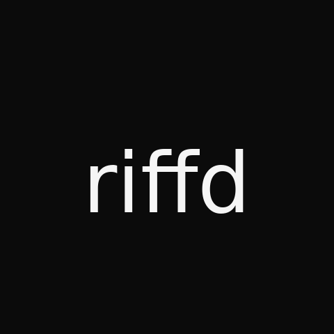

  

  Break down real songs. See how they actually work.

  <a href="https://www.riffdlabs.com"><strong>Live Product →</strong></a>

---

## What It Is

Riffd takes any song and breaks it into its components — isolated stems, detected key and tempo, lyrics, and theory context — in one place. Search a track, trigger an analysis, and within a few minutes you can hear the individual parts, explore what key it's in, and discover other songs built on the same harmonic logic.

Solo-built and deployed. Real infrastructure, real users.

---

## Why I Built It

The insight you get from hearing an isolated bass line is different when you can also see the key, the diatonic chords, and why the progression works — all at once. Those connections don't exist when the tools don't talk to each other. Riffd is the version where they do.

---

## Product Decisions Worth Explaining

**Build for failure, not the happy path.** YouTube blocks requests. Replicate times out. The Claude API returns malformed JSON. The app only became genuinely usable once every external dependency had an explicit fallback and every failure surfaced a clear next step rather than a broken state.

**Silent queue promotion.** When the concurrent job limit is hit, users are queued and promoted automatically when a slot opens — no error message, no manual retry. The degraded state is invisible.

**Partial results over nothing.** The pipeline has five stages. If one fails, the rest still render. A user always gets something rather than a blank screen.

**Prefetch on selection.** Full-track download starts the moment a user selects a song, before they click anything. By the time they trigger analysis, the audio is usually already waiting.

---

## What It Does

**Stem separation** — GPU-accelerated neural source separation via Demucs, isolating vocals, bass, drums, guitar, piano, and other instruments in ~20 seconds on cloud GPU.

**Interactive mixer** — stems sorted by instrument family, with per-stem volume faders, mute, solo, real-time pitch transposition across all stems simultaneously (±12 semitones), loop controls, karaoke mode, and a Full Mix reset that restores energy-balanced defaults.

**Key + tempo detection** — derived from the audio signal via Essentia, not pulled from metadata.

**Key panel** — detected key with its full diatonic chord set, common progressions, relative and parallel key relationships, and a tonality map. Links into the Theory Studio for deeper reference.

**Smart recommendations** — song discovery driven by musical DNA: matching chord progressions, shared key and tempo, or specific harmonic techniques. Built on harmonic analysis, not collaborative filtering or listening history.

**Lyrics** — full text with section structure.

**Theory Studio** — interactive reference for chords, scales, progressions, and keys across every root note, with LLM-powered natural language search.

**Shareable analysis** — every completed analysis gets a permanent URL.

**Per-stem download** — any separated stem is available as an audio file.

**Demo mode** — three pre-baked analyses (Queen, John Mayer, Eagles) available instantly, no processing required.

---

## Technical Highlights

**Audio acquisition.** Full-track download via yt-dlp with dual-binary retry, bot detection bypass, and proxy support. Falls back through Cobalt and Piped APIs before surfacing an upload prompt — no silent degradation to a short preview. Background prefetch fires on song selection so the download is usually complete before the user starts analysis.

**GPU stem separation.** Demucs (htdemucs_6stems) runs on cloud GPU via Replicate's file API. Separation completes in ~20 seconds. STFT-domain panning analysis then refines each stem by stereo position — center, left-panned, right-panned — with RMS energy gating to suppress ghost components below threshold.

**ML pipeline with progressive delivery.** Stem separation (Demucs), pitch extraction (Basic Pitch / TensorFlow), and key/BPM detection (Essentia) run as one end-to-end pipeline with per-stage error isolation. Key and BPM results are pushed to the frontend as they complete, so the user sees them before stems finish loading. Basic Pitch output is further decomposed into lead and accompaniment layers per stem, reusing pre-computed note events to avoid redundant inference passes.

**Mixer and audio engine.** Faders initialize proportional to each stem's RMS energy so the starting mix is balanced without manual adjustment. Real-time pitch transposition applies `AudioBufferSourceNode.detune` across all active stems simultaneously, keeping them phase-coherent.

**LLM-powered insight.** Claude Haiku generates named progressions, key context, and theory-based recommendations from detected key, tempo, and lyrics. It also predicts likely instrumentation before analysis starts — the output is used to guide stem label assignment in Demucs. The Theory Studio's natural language search routes through the same model. All outputs are constrained to strict JSON. Recommendations regenerate independently — no need to re-run the full analysis pipeline.

**Performance.** Audio downloads as MP3 to skip transcoding (10x smaller than WAV). Stems are re-encoded to 192kbps MP3 post-analysis before being served (20x reduction). Heavy Python imports — numpy, TensorFlow, Basic Pitch — are deferred to first job execution, keeping startup RSS around 40MB instead of 300MB.

**Memory and cleanup.** TensorFlow sessions are explicitly cleared after each job via `keras.backend.clear_session()` to prevent memory compounding across sequential runs. Completed jobs are pruned from memory after 10 minutes; job directories from disk after 7 days.

---

## Stack

| Layer | Technology |
|---|---|
| Backend | Python / Flask / Gunicorn |
| Stem separation | Demucs (htdemucs_6stems) via Replicate |
| Pitch detection | Basic Pitch (Spotify) / TensorFlow |
| Audio analysis | Essentia / librosa |
| LLM | Claude Haiku (Anthropic) |
| Audio acquisition | yt-dlp / Cobalt / Piped |
| Search & metadata | Spotify API |
| Lyrics | Genius API |
| Recommendations | Last.fm API |
| Frontend | Vanilla JS / Web Audio API |
| Database | SQLite |
| Deployment | Render (Standard, 2GB) |

---

## Status

Live and in public beta. The full pipeline runs end-to-end — search, acquire, separate, analyze, recommend, display.

---

## About

Solo project by **Dylan Glatt** — New York, NY.

<a href="https://www.linkedin.com/in/dylanjglatt/">LinkedIn</a> · <a href="https://github.com/djglatt">GitHub</a> · <a href="mailto:dylanglatt@gmail.com">dylanglatt@gmail.com</a>
