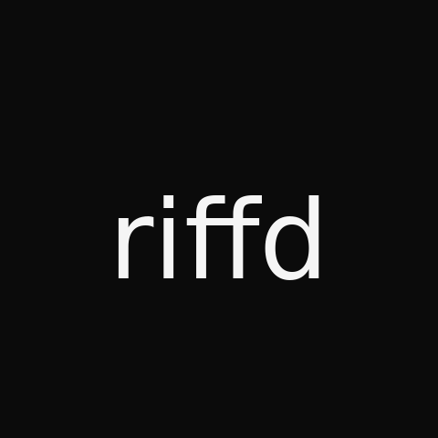
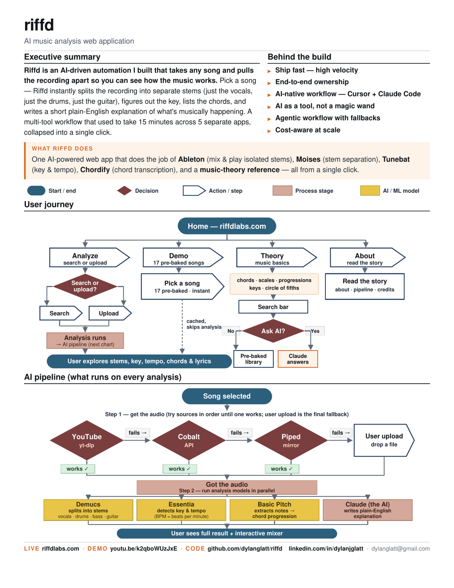

  

  Break down songs. Understand how they work.

  <a href="https://www.riffdlabs.com"><strong>Live Product →</strong></a> · <a href="https://www.youtube.com/watch?v=k2qboWUzJxE"><strong>Demo Video →</strong></a>

  

---

## Overview

Riffd decomposes any song into its musical components — isolated stems, detected key and tempo, lyrics, and theory context — in a single interface. Users search a track, trigger an analysis, and within minutes can audition individual instruments, examine harmonic structure, and discover related songs built on similar musical foundations.

The [Demo Library](https://www.riffdlabs.com/demo) provides pre-analyzed tracks for immediate exploration.

Solo-built, deployed, and operating in production with real users.

---

## Glossary

A few terms used throughout this README that may not be familiar to all readers.

**Music and audio**

- **Stems** — Individual instrument tracks (vocals, drums, bass, guitar, etc.) extracted from a finished, mixed song.
- **Stem separation** — The process of isolating those tracks from a single mixed recording, typically using a neural network.
- **Key** — The tonal center of a song (e.g., C major, A minor); determines which notes and chords sound "in" or "out."
- **BPM** — Beats per minute; the tempo of a song.
- **Diatonic chords** — The seven chords that occur naturally within a given key.
- **Pitch transposition** — Shifting audio up or down in pitch by a fixed amount.
- **Semitone** — The smallest standard interval in Western music; one fret on a guitar, one key on a piano.
- **Phase coherence** — The condition where multiple audio sources stay in correct timing alignment with each other; loss of coherence produces audible artifacts.
- **RMS energy** — Root-mean-square level of an audio signal; a standard measure of perceived loudness.
- **STFT** — Short-Time Fourier Transform; converts audio into a time-versus-frequency representation used for analysis.

**Tools and services**

- **Demucs** — Open-source neural source-separation model from Meta AI; used here to split a song into stems.
- **Basic Pitch** — Spotify's open-source model for detecting individual notes in audio.
- **Essentia** — Open-source audio analysis library; used here for key and tempo detection.
- **librosa** — Python library for general-purpose audio analysis.
- **Replicate** — Cloud platform that runs ML models on GPU and exposes them over an API.
- **yt-dlp** — Open-source command-line tool for downloading audio from YouTube and similar sources.
- **Cobalt / Piped** — Alternative open-source services for retrieving YouTube media when the primary path fails.
- **LLM** — Large language model (e.g., Claude); a generative AI model that produces text from a prompt.
- **Collaborative filtering** — Recommendation technique that suggests items based on what similar users have liked, rather than on the content itself.

---

## Architecture

  

---

## Motivation

Hearing an isolated bass line is one form of musical insight. Seeing the key, the diatonic chords, and the underlying harmonic logic at the same time is another. Existing tools treat these as separate concerns. Riffd integrates them.

---

## Engineering Decisions

**Resilience-first design.** External services fail routinely: YouTube blocks requests, Replicate times out, and the Claude API occasionally returns malformed JSON. Every external dependency in Riffd has an explicit fallback, and every failure surfaces a clear recovery path rather than a broken state.

**Silent queue promotion.** When concurrent job limits are reached, users are queued and promoted automatically as slots open. Riffd surfaces no error message and requires no manual retry — the degraded state is invisible to the user.

**Graceful degradation.** The analysis pipeline has five stages with per-stage error isolation. If one stage fails, the remaining stages still render. Users receive whatever Riffd successfully produced rather than a blank screen.

**Prefetch on selection.** Full-track download begins the moment a user selects a song, before any explicit action is taken. By the time analysis is triggered, the audio is typically already cached.

---

## Features

**Stem separation.** GPU-accelerated neural source separation via Demucs, isolating vocals, bass, drums, guitar, piano, and other instruments in approximately 20 seconds on cloud GPU.

**Interactive mixer.** Stems organized by instrument family, with per-stem volume faders, mute, solo, real-time pitch transposition across all stems simultaneously (±12 semitones), loop controls, karaoke mode, and a Full Mix reset that restores energy-balanced defaults.

**Key and tempo detection.** Derived directly from the audio signal via Essentia, not pulled from metadata.

**Key panel.** Detected key with full diatonic chord set, common progressions, relative and parallel key relationships, and a tonality map. Links into the Theory Studio for deeper reference.

**Smart recommendations.** Song discovery driven by musical structure: matching chord progressions, shared key and tempo, or specific harmonic techniques. Built on harmonic analysis rather than collaborative filtering or listening history.

**Lyrics.** Full text with section structure.

**Theory Studio.** Interactive reference for chords, scales, progressions, and keys across every root note, with LLM-powered natural language search.

**Shareable analysis.** Every completed analysis receives a permanent URL.

**Per-stem download.** Any separated stem is available as an audio file.

**Demo mode.** Pre-analyzed tracks across multiple genres, available instantly with no processing required. Filterable by genre.

---

## Technical Highlights

**Audio acquisition.** Full-track download via yt-dlp with dual-binary retry, bot detection bypass, and proxy support. Riffd falls back through Cobalt and Piped APIs before surfacing an upload prompt, rather than silently degrading to a short preview. Background prefetch fires on song selection, so the download is typically complete before the user begins analysis.

**GPU stem separation.** Demucs (htdemucs_6s) runs on cloud GPU via Replicate's file API, completing separation in approximately 20 seconds. STFT-domain panning analysis then refines each stem by stereo position — center, left-panned, right-panned — with RMS energy gating to suppress ghost components below threshold.

**ML pipeline with progressive delivery.** Stem separation (Demucs), pitch extraction (Basic Pitch / TensorFlow), and key/BPM detection (Essentia) run as one end-to-end pipeline with per-stage error isolation. Key and BPM results are pushed to the frontend as they complete, so users see them before stems finish loading. Basic Pitch output is further decomposed into lead and accompaniment layers per stem, reusing pre-computed note events to avoid redundant inference passes.

**Mixer and audio engine.** Faders initialize proportional to each stem's RMS energy, producing a balanced starting mix without manual adjustment. Real-time pitch transposition applies `AudioBufferSourceNode.detune` across all active stems simultaneously, maintaining phase coherence.

**LLM-powered insight.** Claude Haiku generates named progressions, key context, and theory-based recommendations from detected key, tempo, and lyrics. The model also predicts likely instrumentation before analysis starts, guiding stem label assignment in Demucs. The Theory Studio's natural language search routes through the same model. All outputs are constrained to strict JSON. Recommendations regenerate independently, eliminating the need to re-run the full analysis pipeline.

**Performance.** Audio downloads as MP3 to skip transcoding (10x smaller than WAV). Stems are re-encoded to 192 kbps MP3 post-analysis before being served (20x reduction). Heavy Python imports — numpy, TensorFlow, Basic Pitch — are deferred to first job execution, keeping startup RSS at approximately 40 MB instead of 300 MB.

**Memory and cleanup.** TensorFlow sessions are explicitly cleared after each job via `keras.backend.clear_session()` to prevent memory compounding across sequential runs. Completed jobs are pruned from memory after 10 minutes; job directories are removed from disk after 7 days.

---

## Stack

| Layer | Technology |
|---|---|
| Backend | Python / Flask / Gunicorn |
| Stem separation | Demucs (htdemucs_6s) via Replicate |
| Pitch detection | Basic Pitch (Spotify) / TensorFlow |
| Audio analysis | Essentia / librosa |
| LLM | Claude Haiku (Anthropic) |
| Audio acquisition | yt-dlp / Cobalt / Piped |
| Search & metadata | Spotify API |
| Lyrics | Genius API |
| Recommendations | Last.fm API |
| Frontend | Vanilla JS / Web Audio API |
| Database | SQLite |
| Deployment | Render (Standard, 2 GB) |

---

## Status

Live and in public beta. The full pipeline runs end-to-end: search, acquire, separate, analyze, recommend, display.

Solo project by **Dylan Glatt** — New York, NY.

<a href="https://www.linkedin.com/in/dylanjglatt/">LinkedIn</a> · <a href="https://github.com/dylanglatt">GitHub</a> · <a href="mailto:dylanglatt@gmail.com">dylanglatt@gmail.com</a>
